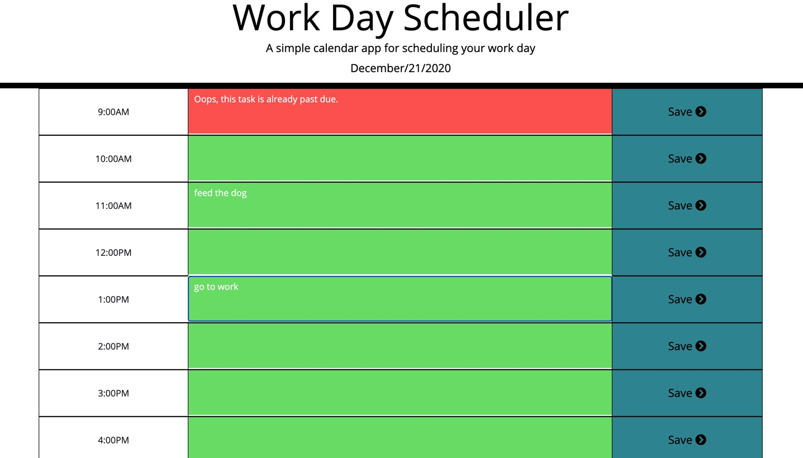

# Day-Planner

## Installation
this site can be deployed via this link in your web browser:

## Usage
This day planner utilizes [date-fns](https://date-fns.org/docs/Getting-Started) to display the current date for the user.  Each hour of the work day is represented, with color codes to coincide with times past, present, and future.  This allows the user to stay organized and dictate tasks accordingly.  The user can save tasks in local storage and they will remain on the page when refreshed. Creating this project was a learning experience in dealing with times in Javascript.  Calculating and formatting the time with respect to individual hours in the day was the most challenging part of creating this application.  I found the documentation of date-fns difficult to understand, and so I only utilized it to display the date at the top, while I resorted to other methods for the rest of the project.
Below is an example of the application in use:

